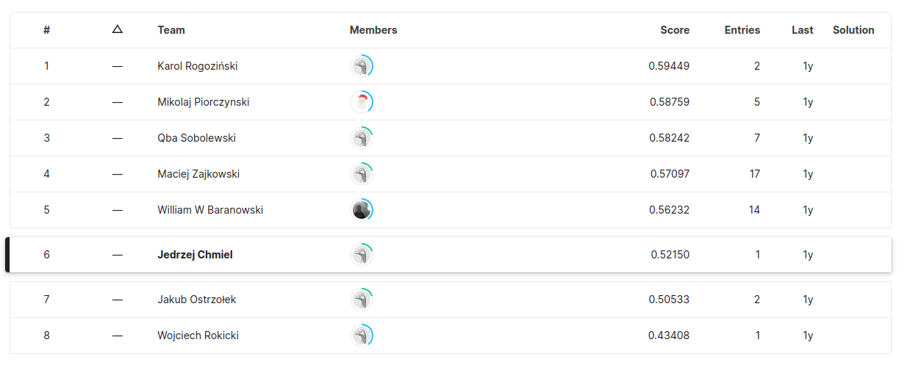

# AdaBoost
The AdaBoost project is my original implementation of the Machine Learning algorithm called "AdaBoost" . I used this implementation in the [Kaggle contest (link)](https://www.kaggle.com/competitions/knsi-golem-bootcamp2021-competition/leaderboard) in which I took 6th place. I didn't use any Machine Learning libraries (like scikit-learn or pytorch), it's written using only NumPy and Pandas.    

